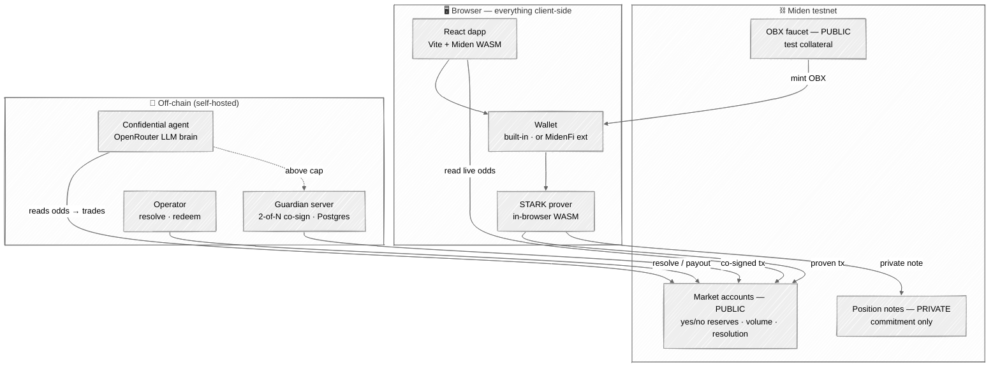
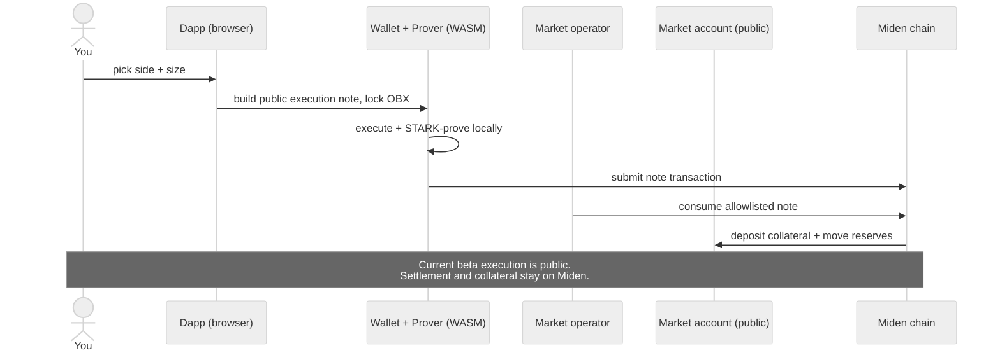
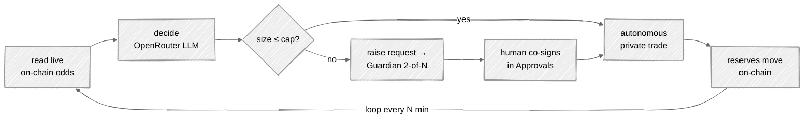
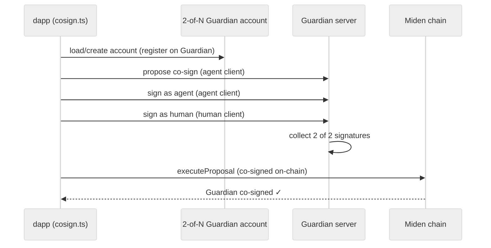

<div align="center">


# Subrosa

**Private prediction markets with confidential AI agents, on [Miden](https://miden.xyz).**

Public, trustworthy **odds** but your **position, size, and P&L stay private**.
The chain records only a *commitment*.

[](https://testnet.midenscan.com)
[](https://github.com/OpenZeppelin/guardian)
[](./LICENSE)

</div>

---

## Why Subrosa

On a normal prediction market, everyone can see *who* bet, on *what side*, for *how much*. That leaks your edge, invites copy-trading, and makes a confidential trading strategy impossible.

Subrosa flips the privacy model using Miden's client-side execution:

|                       | Public (on-chain, verifiable) | Private (commitment only) |
| --------------------- | ----------------------------- | ------------------------- |
| Market **odds**       | ✅ reserves are public         |                           |
| Total **volume**      | ✅                             |                           |
| **Resolution** outcome| ✅                             |                           |
| Your **side**         |                               | 🔒                        |
| Your **size**         |                               | 🔒                        |
| Your **identity**     |                               | 🔒                        |
| Your **P&L**          |                               | 🔒                        |

The odds stay trustworthy *because* the reserves are public — but a position is a **private note**, so the network only ever sees a hash. That's the whole product: **trustworthy odds, confidential positions.**

---

## Architecture



**Four layers:**

1. **Frontend** (`web/app`) — a React dapp that runs the **Miden WASM client in the browser**: it builds, executes, and STARK-proves transactions locally, then submits the proof.
2. **Contracts** (`contracts/`) — the `market` **account component** (public reserves + CPMM odds), collateralized execution notes, and an on-chain redemption guard.
3. **Confidential agent** (`agent/`) — an autonomous trader with an LLM brain and a programmable-auth risk cap.
4. **Guardian** (OpenZeppelin) — a self-hosted 2-of-N co-sign coordinator for trades above the agent's cap.

Polymarket can be used as an external catalogue, price benchmark and resolution
reference while execution stays on Miden. The current beta uses discoverable
public execution notes, so amount and script are not private. Its exact trust
boundary is documented in [`docs/POLYMARKET.md`](./docs/POLYMARKET.md).

---

## How it works

### 1 · Placing a mirrored position



The contract derives stake size from the note's single fungible asset, deposits
that asset into the market vault, and updates reserves atomically. It never
trusts a caller-supplied amount. The dapp stores a local wallet-side position
record and shows the note and transaction identifiers.

### 2 · Resolution & redemption

The market account has a one-shot `resolve(outcome)` written by its authenticated
operator. The relay only acts after the allowlisted Polymarket condition closes
at an unambiguous 1/0 outcome. The contract's `redeem` guard rejects unresolved
and losing claims; production payout-note plumbing remains to be completed.

### 3 · The confidential agent + programmable-auth cap



The agent trades from its **own private account**, so its strategy and book stay hidden — an edge that can't be copied. Miden has no native *size-conditional* multisig, so the cap is enforced app-side: **at/below cap → the agent acts alone; above cap → it must get a human co-signature**, coordinated by Guardian. The loop ships with real safety rails (budget, max-trades, kill-switch file, error backoff, stand-down on resolution).

### 4 · Guardian co-sign (protected bets)

When you place a **protected** bet, the dapp runs a real, live **2-of-N + Guardian** ceremony on Miden testnet before sealing the position — not a mock. Each user gets their own **Guardian betting account** (a 2-of-N multisig: an agent key + a human key, both held client-side; threshold 2 with Guardian enabled), created once and cached in the browser.



**Each cosigner uses its own `MultisigClient`.** `MultisigClient.load(account, signer)` calls `guardianClient.setSigner(signer)` on a *shared* client, so loading both signers on one client made Guardian attribute both signatures to whichever signer loaded last (`409 already_signed`, stuck at "1 of 2"). Giving the agent and human **separate clients** makes their Guardian auth independent, so both signatures register and `executeProposal` reaches threshold. The two cosigner keys are also seeded from a CSPRNG (`rpoFalconWithRNG(randSeed())`) so they're genuinely distinct, with a self-heal + identity-version bump that abandons any earlier broken account.

Guardian is **non-custodial** — it coordinates and acknowledges, it never holds a spending key. It's a resilience/coordination layer, self-hosted so private payloads never leave infrastructure you control. (The agent's *above-cap* trading path uses the same primitive server-side.)

---

## Live on Miden testnet

Every market is a **public account** — open it on the explorer and verify the reserves/resolution yourself (the dapp links to these via *“verify on-chain”*):

| Market | Account ID | Explorer |
| ------ | ---------- | -------- |
| Will Morocco win the 2026 FIFA World Cup? (Polymarket mirror) | `0xabbba77bce4bc6d1795be21b30fa5e` | [view](https://testnet.midenscan.com/account/0xabbba77bce4bc6d1795be21b30fa5e) |
| Will Ethereum reach $2,000 in July? (Polymarket mirror) | `0x72d3ac938ff65611194c3e21d118e9` | [view](https://testnet.midenscan.com/account/0x72d3ac938ff65611194c3e21d118e9) |
| Fed rate cut by September 2026 meeting? (Polymarket mirror) | `0xca646b034eb701311909b674f207ac` | [view](https://testnet.midenscan.com/account/0xca646b034eb701311909b674f207ac) |

---

## Tech stack

| Layer | Stack |
| ----- | ----- |
| **Contracts** | Rust + Miden SDK 0.13 → `cargo miden build` → MASM `.masp` |
| **Chain ops** | `miden-client` 0.14 (account creation, prove, submit) |
| **Frontend** | React 19 · Vite · `@miden-sdk/react` + `@miden-sdk/miden-sdk` 0.14.11 · in-browser WASM proving |
| **Wallets** | built-in web-SDK wallet · MidenFi browser extension (wallet-adapter) |
| **Agent** | Node + `tsx` · OpenRouter (`gpt-4o-mini`) · heuristic fallback |
| **Co-sign** | OpenZeppelin **Guardian** (Rust + Postgres) · `@openzeppelin/miden-multisig-client` |
| **Deploy** | Railway (Docker) — see [`docs/DEPLOY.md`](./docs/DEPLOY.md) |

**Cross-origin isolation:** the WASM client needs `SharedArrayBuffer`, so the app serves `COOP: same-origin` + `COEP: credentialless` — the latter lets the client talk **directly** to the public testnet RPC/prover without a proxy.

---

## Repository layout

```
subrosa/
├── contracts/
│   └── market/        Miden account component: place / resolve / redeem, public reserves
├── client/            Rust bins: run_script, place_position, verify_privacy
├── scripts/           compiled tx-scripts (place/resolve/redeem) + operator/lifecycle
├── agent/             confidential agent loop · LLM brain · Guardian · fund/redeem services
│   └── docker/        self-hosted Guardian compose
├── web/
│   ├── app/           the React dapp (landing + /app + /cosign) — deployed frontend
│   └── landing/       standalone marketing page
└── docs/              DEPLOY · GUARDIAN · DECISIONS · architecture notes
```

---

## Run it locally

**Frontend (the dapp):**
```bash
cd web/app
npm install
npm run dev            # → http://localhost:5173  (landing) ·  /app/  (dapp)
```
Connect the built-in wallet, click **Fund** (in-browser OBX faucet), and place a position — it proves in your browser and lands on testnet.

**Confidential agent (autonomous trading):**
```bash
cd agent
npm install
npm start              # reads odds → LLM decides → places · every 5 min
SUBROSA_DRY_RUN=1 npm start   # decide + log, never submit (safe anywhere)
```

**Guardian server (for the co-sign path):**
```bash
git clone https://github.com/OpenZeppelin/guardian ../guardian
cd agent && npm run guardian:up        # Docker → :3000 / :50051  (needs DATABASE_URL)
```

> Markets, wallets, funding, and positions work with just the frontend. The agent
> loop and operator services need the native `miden-client` toolchain + a funded
> keystore. Full deployment guide: [`docs/DEPLOY.md`](./docs/DEPLOY.md).

---

## Principles

- **Privacy is the product** — every private flow is provable on the explorer (commitment in, nothing leaked).
- **Verify every Miden API before use; pin versions; build phase by phase.**
- **Public reserves = trustworthy odds; private notes = confidential positions.**

<div align="center"><sub>Built on Miden · "sub rosa" — under the rose, in confidence.</sub></div>
